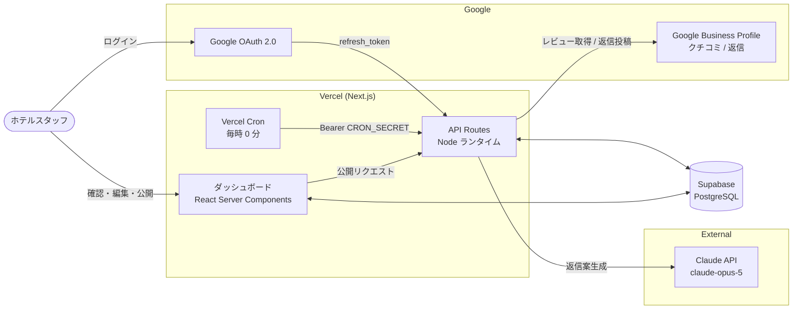
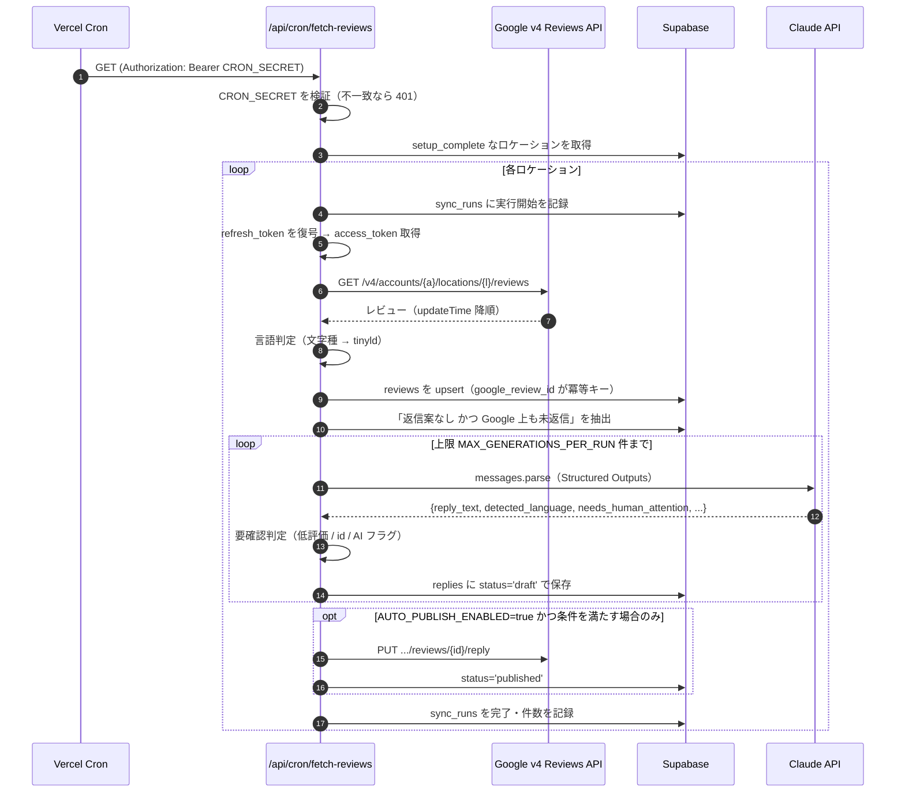

# 01. アーキテクチャと全体構造

## 1. システム全体像



**設計の中心にある判断: 完全自動公開をしない。**
AI が生成した返信は Google 上に恒久的に公開され、将来の宿泊検討者が読みます。
誤った返信は削除しても検索キャッシュに残り、ブランド毀損が回復困難です。
そのため既定動作は「全件ドラフト保存 → 人間が確認して公開」であり、
自動公開は環境変数で明示的に有効化したときだけ、かつ厳しい条件下でのみ動きます。

---

## 2. ファイルツリー

```
hoshi-jungle-review-ai/
├── .env.example                  # 環境変数テンプレート（全キーの説明付き）
├── vercel.json                   # Cron 定義（毎時）+ 関数の maxDuration
├── next.config.mjs
├── tailwind.config.ts
├── tsconfig.json                 # paths: "@/*" -> "./src/*"
│
├── docs/
│   ├── 01-architecture.md        # 本ドキュメント
│   ├── 02-google-oauth-flow.md   # 認証フローと Google Cloud 側の設定
│   ├── 03-database-schema.md     # テーブル設計と設計判断
│   ├── 04-runbook.md             # セットアップ・デプロイ・運用・コスト
│   └── 05-staff-access.md        # スタッフ引き渡しと権限設計
│
├── supabase/
│   └── migrations/
│       ├── 0001_init.sql         # ENUM / テーブル / インデックス / ビュー
│       ├── 0002_rls.sql          # Row Level Security（多層防御）
│       └── 0003_staff_access.sql # スタッフ用パスコードと監査ログ
│
├── tests/                        # node:test + tsx（npm test）
│   ├── crypto.test.ts            # トークン暗号化の往復・改ざん検出
│   ├── passcode.test.ts          # パスコード生成・ハッシュ・検証
│   ├── detect.test.ts            # 言語判定（短文日本語の回帰テスト含む）
│   ├── policy.test.ts            # 自動公開ポリシーのガード
│   └── prompt.test.ts            # プロンプトの必須要素
│
└── src/
    ├── app/
    │   ├── layout.tsx
    │   ├── globals.css
    │   ├── page.tsx                      # ログイン / ランディング
    │   ├── onboarding/page.tsx           # 初期設定ウィザード（3ステップ）
    │   │
    │   ├── dashboard/
    │   │   ├── layout.tsx                # ナビ・件数バッジ・再認証バナー
    │   │   ├── page.tsx                  # 未返信（言語別タブ）
    │   │   ├── pending/page.tsx          # 要確認リスト（承認待ち）
    │   │   └── archive/page.tsx          # 返信履歴
    │   │
    │   └── api/
    │       ├── auth/google/route.ts              # 同意画面へリダイレクト
    │       ├── auth/google/callback/route.ts     # code 交換 → users upsert → セッション
    │       ├── auth/logout/route.ts
    │       ├── locations/route.ts                # Google のロケーション一覧
    │       ├── locations/select/route.ts         # 登録 + 初回同期
    │       ├── replies/[replyId]/route.ts        # PATCH: 編集 / スキップ
    │       ├── replies/[replyId]/publish/route.ts  # POST: ワンクリック公開
    │       ├── replies/[replyId]/regenerate/route.ts # POST: AI で作り直す
    │       ├── sync/route.ts                     # 手動同期
    │       └── cron/fetch-reviews/route.ts       # 毎時バッチ（CRON_SECRET 認証）
    │
    ├── components/
    │   ├── SetupWizard.tsx       # ウィザード ステップ2-3（client）
    │   ├── ReviewCard.tsx        # クチコミ + 返信エディタ + 公開ボタン（client）
    │   ├── LanguageTabs.tsx      # 言語別タブ（id はオレンジで優先表示）
    │   ├── StarRating.tsx
    │   └── SyncButton.tsx
    │
    └── lib/
        ├── env.ts                # 環境変数の遅延読み取り + 型付け
        ├── constants.ts          # サーバー/クライアント共用の定数
        ├── crypto.ts             # refresh_token の AES-256-GCM 暗号化
        ├── passcode.ts           # パスコード生成 / scrypt ハッシュ / 検証
        ├── session.ts            # 役割付きセッション（owner / staff）
        ├── api.ts                # requireSession / requireOwner / スコープ
        ├── database.types.ts     # Supabase のスキーマ型（FK 定義含む）
        │
        ├── auth/
        │   └── staffLogin.ts     # パスコード照合 + IP レート制限
        │
        ├── supabase/
        │   └── admin.ts          # service_role クライアント（server-only）
        │
        ├── google/
        │   ├── oauth.ts          # 認可 URL / code 交換 / refresh / revoke
        │   ├── accessToken.ts    # refresh_token → access_token（プロセス内キャッシュ）
        │   └── businessProfile.ts # 3 ホストにまたがる API クライアント + リトライ
        │
        ├── lang/
        │   └── detect.ts         # 文字種チェック → tinyld の 2 段構え
        │
        ├── ai/
        │   ├── prompt.ts         # システム/ユーザープロンプト組み立て
        │   └── generateReply.ts  # Claude 呼び出し（Structured Outputs）
        │
        └── reviews/
            ├── policy.ts         # 要確認判定 / 自動公開可否（品質管理の単一の出所）
            ├── sync.ts           # 同期パイプライン（取得→保存→生成→公開）
            ├── publish.ts        # 所有権チェック付きの公開処理
            └── queries.ts        # ダッシュボードの読み取りクエリ
```

---

## 3. データフロー（毎時バッチ）



### 冪等性

`reviews.google_review_id` に UNIQUE 制約、`replies.review_id` に UNIQUE 制約を置いているため、
**同じバッチが二重に走ってもレビューは重複せず、返信案も 1 レビュー 1 件しか作られません。**
Cron の再実行・手動同期の同時押し・デプロイ直後の重複起動のいずれでも壊れません。

### 失敗の扱い

| 失敗の種類 | 挙動 |
|---|---|
| Google 429 / 5xx | 指数バックオフで最大 3 回リトライ（`businessProfile.ts`） |
| Google 401（トークン失効） | `users.token_revoked_at` を記録し、ダッシュボードに再認証バナーを表示 |
| Claude のレート制限 / 5xx | そのレビューはスキップ。次回のバッチで再試行される |
| Claude の応答拒否（`stop_reason: refusal`） | `replies.status='failed'` + 要確認で記録し、無限再試行を止める |
| ロケーションの連続失敗 10 回以上 | 毎時実行をやめ、1 日 1 回（UTC 0 時）のみ再試行してクォータを守る |

すべての実行は `sync_runs` テーブルに記録されるため、障害調査は SQL 1 本で完結します。

---

## 4. 技術選定で仕様から変更した点

| 項目 | 仕様 | 実装 | 理由 |
|---|---|---|---|
| 言語検出 | `langdetect` | `tinyld` | langdetect は Python ライブラリで Next.js / Vercel の Node ランタイムでは動かない。tinyld は同等の n-gram 判定を行う TypeScript ネイティブ実装 |
| 言語検出（補強） | ライブラリ単体 | 文字種チェック → tinyld → Claude | 実測で「最高！」のような短い日本語を tinyld が判定不能（候補ゼロ）で返した。クチコミは短文比率が高いため、決定的に判別できる文字種チェックを前段に置いた |
| 認証基盤 | Supabase + Google OAuth | Google OAuth のみ（自前の署名付き Cookie） | 認証の主目的が Business Profile API の操作権限取得であり、Supabase Auth を併用すると refresh_token の所在が分散して事故りやすい |
| replies.status | `draft` / `published` | `draft` / `edited` / `published` / `failed` / `skipped` | 「AI 生成のまま」と「人間が編集済み」を区別しないと、承認待ちリストで何を見ればよいか分からなくなる。`failed` / `skipped` は運用上必須 |
| スタッフのログイン | 記載なし | パスコード認証を追加（`owner` / `staff` の 2 役割） | `business.manage` はビジネスプロフィール全体を操作できる権限。フロントスタッフ全員に Google アカウントを共有させるのは過剰で、退職時の権限剥奪も煩雑。詳細は [docs/05](05-staff-access.md) |


## 配色（白地に赤）

営業資料と同じ紅白に揃えています。資料と画面の色が違うと別物に見えるためです。
元の緑（`jungle`）はバリ島のホテル 1 軒のための色でした。

| トークン | 用途 |
|---|---|
| `brand-*`（赤） | 見出し・主ボタン・強調・エラー |
| `ink-*`（無彩色） | 本文・ラベル・枠線・地 |

**色は測ってから決めています。** 小さい文字は背景との比が 4.5:1 以上（WCAG AA）を
満たす値だけを使い、実測値は `tailwind.config.ts` のコメントに残しています。
いちばん薄い文字は `ink-400`（白地 5.02:1 / 地 4.69:1 / 淡赤 4.55:1）で、
これ以上薄い色は使いません。

### 赤にしなかったもの

- **「要確認」の黄色**（`amber-*`）はそのままです。
  低評価や人間の確認が要るクチコミを示す、このシステムで最も安全に関わる signal です。
  赤の画面の中に赤で警告を描くと埋もれます。
- **「済み」の緑は無彩色にしました。** 文言（公開済み）で意味が伝わるためです。
  代わりに「公開済み」だけを塗りつぶしの赤にして、遠目でも他の状態と混ざらないように
  しています（失敗は同じ赤でも白抜き＋枠線）。

体験デモ（`hoshi-jungle/demo/index.html`）も同じ値に揃えてあります。
