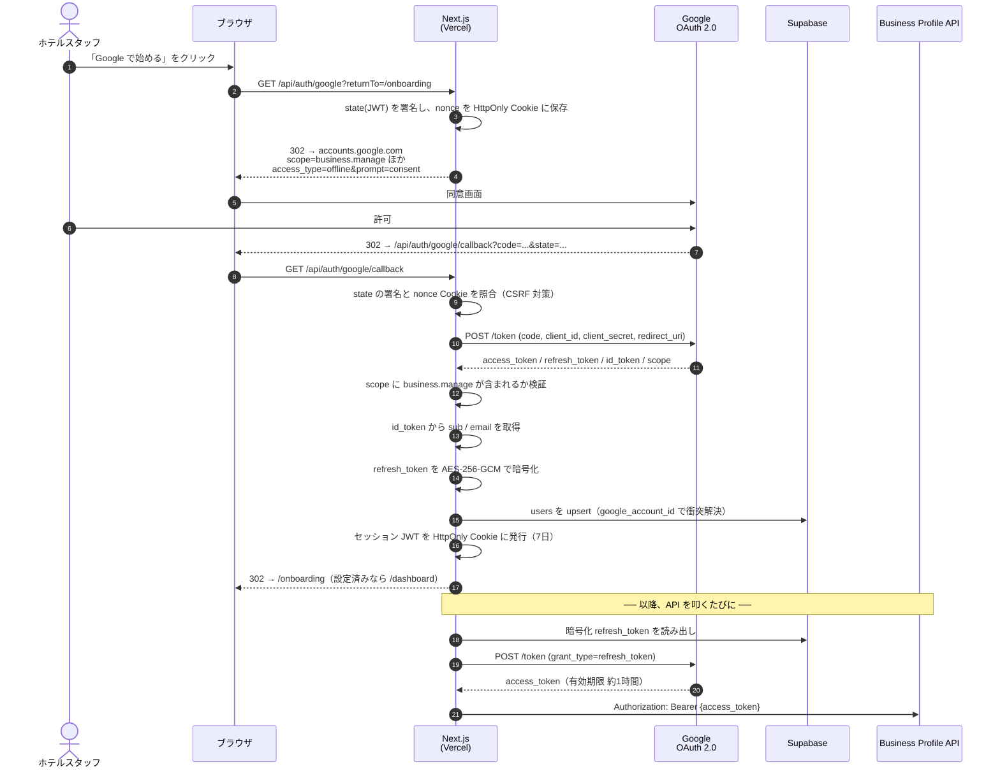
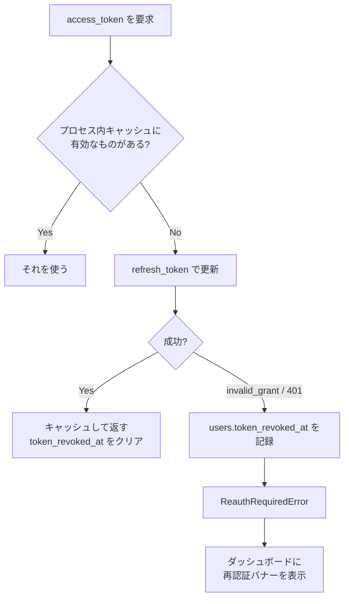

# 02. Google Business Profile API の認証フロー

## 0. 最初に押さえるべき「落とし穴」

Google のビジネスプロフィール API は 2022 年に、1 本だった v4 API が**用途別の複数 API に分割**されました。
しかし **レビュー（取得・返信）だけは新 API に移行されておらず、旧 v4 エンドポイントが現役**です。

この結果、本システムは 3 つのホストを使い分けます。

| 用途 | ホスト | 状態 |
|---|---|---|
| アカウント一覧 | `mybusinessaccountmanagement.googleapis.com/v1` | 新 API |
| ロケーション一覧 | `mybusinessbusinessinformation.googleapis.com/v1` | 新 API |
| **レビュー取得 / 返信投稿** | **`mybusiness.googleapis.com/v4`** | **レガシー（現役）** |

「v4 は廃止された」という前提でコードを書くと、レビュー機能が丸ごと実装できません。
逆に「全部 v4 でいける」と書くと、アカウント/ロケーション取得が 404 になります。
実装済みの `src/lib/google/businessProfile.ts` がこの使い分けを吸収しています。

さらに重要な前提が 2 つあります。

1. **API の利用申請が必要。** Google Cloud プロジェクトを作って API を有効化しただけでは、
   既定のクォータが 0 のため実際には呼べません。Google の「Business Profile APIs アクセス申請フォーム」
   を提出して承認を得る必要があります。**承認には数営業日〜数週間かかります。**
   開発着手と同時に申請を出してください。ここがプロジェクト最大のリードタイム要因です。
2. **返信本文の上限は 4,096 文字。** 超過すると API が 400 を返します。
   本システムは生成時・保存時・公開時の 3 箇所でこれを検証しています。

---

## 1. 認証フロー図



### トークンの失効と再認証



`invalid_grant` は「ユーザーが Google 側でアクセス権を削除した」「refresh_token が長期間未使用で失効した」
などで起きます。バッチが黙って失敗し続けるのが最悪なので、DB にフラグを立てて UI に出す設計にしています。

---

## 2. スコープ

```
openid
email
profile
https://www.googleapis.com/auth/business.manage
```

`business.manage` は **ビジネスプロフィール全体を管理できる単一スコープ**です。
「レビューの読み取りだけ」「返信だけ」といった細分化スコープは提供されていません。
同意画面でユーザーに説明する際は、この点を正直に伝える必要があります（投稿の編集や写真の管理も
技術的には可能な権限を渡すことになるため）。

### `access_type=offline` と `prompt=consent`

- `access_type=offline` … `refresh_token` を発行させるために必須。
- `prompt=consent` … 2 回目以降のログインでも `refresh_token` を再発行させる。
  これを付けないと、初回に取得した `refresh_token` の保存に失敗した場合、
  同意を一度取り消さない限り二度と取得できなくなります。

---

## 3. Google Cloud Console 側の設定手順

1. **プロジェクト作成** — Google Cloud Console で新規プロジェクトを作る。
2. **API を有効化** — 以下 4 つをすべて有効にする。
   - Google My Business API（レガシー v4。レビューに必須）
   - My Business Account Management API
   - My Business Business Information API
   - My Business Notifications API（将来の Pub/Sub 連携用。今は任意）
3. **アクセス申請** — Google の「Business Profile APIs アクセス申請フォーム」を提出する。
   承認されるまでクォータが割り当てられない。**最優先で着手すること。**
4. **OAuth 同意画面** — User Type / アプリ名 / サポートメール / スコープ（`business.manage`）を設定。
   外部公開する場合は Google の審査が必要。ホテル内部利用のみなら「テストユーザー」に
   スタッフの Google アカウントを登録する運用でも動く。
5. **OAuth クライアント ID を作成** — 種類は「ウェブ アプリケーション」。
   承認済みのリダイレクト URI に以下を**両方**登録する（完全一致が必要）。
   ```
   http://localhost:3000/api/auth/google/callback
   https://<本番ドメイン>/api/auth/google/callback
   ```
6. **クライアント ID / シークレットを `.env` に設定** — `GOOGLE_CLIENT_ID` / `GOOGLE_CLIENT_SECRET`。

### ログインするアカウントの条件

ログインする Google アカウントが、対象のビジネスプロフィールに対して
**オーナーまたは管理者**の権限を持っている必要があります。
権限がないと `/api/locations` がロケーションを 0 件で返します。

> **⚠️ ログインに使うのは必ず Hoshi Jungle のアカウントです。**
> そのアカウントの `refresh_token` が保存され、以降すべてのクチコミ取得と
> 返信投稿がその権限で実行されます。代行者個人のアカウントを使うと、
> その人がアクセス権を失った時点でシステムが停止します。
> Google Cloud プロジェクトの名義をどうするかも含め、[docs/06](06-google-account-ownership.md) を参照。

---

## 4. 使用しているエンドポイント一覧

| 操作 | メソッド | パス |
|---|---|---|
| アカウント一覧 | GET | `https://mybusinessaccountmanagement.googleapis.com/v1/accounts` |
| ロケーション一覧 | GET | `https://mybusinessbusinessinformation.googleapis.com/v1/{accounts/*}/locations?readMask=name,title,storefrontAddress,metadata` |
| レビュー一覧 | GET | `https://mybusiness.googleapis.com/v4/accounts/{a}/locations/{l}/reviews?pageSize=50&orderBy=updateTime desc` |
| 返信の投稿/更新 | PUT | `https://mybusiness.googleapis.com/v4/accounts/{a}/locations/{l}/reviews/{reviewId}/reply` |
| 返信の削除 | DELETE | `https://mybusiness.googleapis.com/v4/accounts/{a}/locations/{l}/reviews/{reviewId}/reply` |

### 実装上の注意

- **ロケーション ID の形式差**: 新 API は `locations/{id}` を返しますが、v4 は
  `accounts/{accountId}/locations/{locationId}` というパスを要求します。
  そのため `locations` テーブルには `google_account_name` も必ず保存しています
  （`reviewParentPath()` がこの結合を担当）。
- **`readMask` は必須**: Business Information API は `readMask` なしだと 400 を返します。
  必要なフィールドだけを指定することがレスポンスサイズとクォータの両方に効きます。
- **`starRating` は文字列 ENUM**: `ONE` 〜 `FIVE`（および `STAR_RATING_UNSPECIFIED`）。
  数値ではありません。`starRatingToNumber()` で変換しています。
- **`pageSize` の上限は 50**（レビュー一覧）。

---

## 5. 参考リンク

- [Google Business Profile APIs — Work with review data](https://developers.google.com/my-business/content/review-data)
- [Method: accounts.locations.reviews.updateReply](https://developers.google.com/my-business/reference/rest/v4/accounts.locations.reviews/updateReply)
- [Package google.mybusiness.v4](https://developers.google.com/my-business/reference/rpc/google.mybusiness.v4)
- [Deprecation schedule](https://developers.google.com/my-business/content/sunset-dates)
