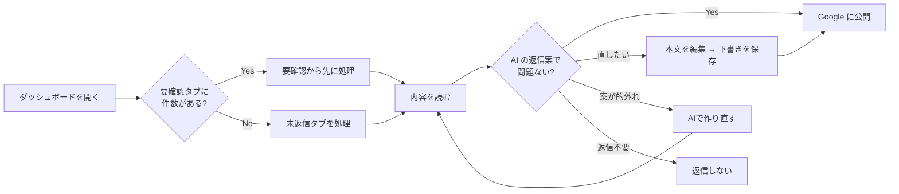

# 04. セットアップ・運用・コスト

## 1. 導入までのクリティカルパス

```mermaid
gantt
    dateFormat X
    axisFormat %s
    section 並行して進める
    Google API アクセス申請（数営業日〜数週間）:crit, a1, 0, 20
    Supabase プロジェクト作成 + マイグレーション :a2, 0, 2
    Vercel デプロイ + 環境変数設定            :a3, 2, 4
    ローカルでの動作確認                      :a4, 4, 8
    section 承認後
    本番での初回同期・返信品質の調整           :a5, 20, 26
```



**費用の前提**: **月額 $0 で運用できます。**
Netlify Free + GitHub Actions + Supabase Free + Claude の無料クレジットという構成です。
手順は [docs/07](07-free-tier.md) にまとめてあります（本ドキュメントの Vercel 手順は、
将来 Vercel Pro に移行する場合のための参考です）。

**最優先タスクは Google の API アクセス申請です。** 承認が下りるまでレビューを 1 件も取得できません。
コードの完成を待たずに、今日中に申請を出してください（手順は `docs/02-google-oauth-flow.md` §3）。

---

## 2. セットアップ

> **⚠️ 先に決めること: どの Google アカウントを使うか**
>
> アプリにログインする Google アカウントは、**必ず Hoshi Jungle のアカウント**を使ってください。
> そのアカウントの権限でクチコミの取得と返信の投稿が行われるためです。
> 代行者個人のアカウントでログインすると、その人がホテルのビジネスプロフィールへの
> アクセスを失った時点でシステム全体が停止します。
> 詳細と、Google Cloud プロジェクトの名義をどうするかは [docs/06](06-google-account-ownership.md)。

### 2.1 Supabase — ✅ 作成・適用済み

**このステップは完了しています。** 以下のプロジェクトが作成され、
マイグレーション 4 本の適用と動作検証まで済んでいます。

| 項目 | 値 |
|---|---|
| プロジェクト名 | `hoshi-jungle-review-ai` |
| プロジェクト ref | `iwwddgqbollzzmzjrvak` |
| API URL | `https://iwwddgqbollzzmzjrvak.supabase.co` |
| リージョン | ap-southeast-1（シンガポール／バリから最も近い） |
| プラン | **Free（$0）** |

環境変数に設定する値:

```
SUPABASE_URL=https://iwwddgqbollzzmzjrvak.supabase.co
SUPABASE_SERVICE_ROLE_KEY=（下記の手順で取得）
```

`service_role` キーは **RLS をバイパスする最重要の秘密**のため、ここには記載しません。
[Supabase Dashboard](https://supabase.com/dashboard/project/iwwddgqbollzzmzjrvak/settings/api-keys)
→ Project Settings → API Keys → `service_role` からコピーしてください。
Vercel には必ず Encrypted で登録し、リポジトリにはコミットしないこと。

#### 適用済みの内容と検証結果

| マイグレーション | 内容 |
|---|---|
| `0001_init` | ENUM 3種・テーブル5つ・インデックス・ビュー `review_queue` |
| `0002_rls` | 全テーブルで RLS 有効化＋`anon`/`authenticated` 全拒否 |
| `0003_staff_access` | スタッフ用パスコードと監査ログ |
| `0004_harden_function_search_path` | トリガ関数の `search_path` 固定（セキュリティリンタ対応） |

実 DB に対して以下を検証済みです。

- 生成列 `final_text` が編集の有無に応じて正しく切り替わる
- `published` なのに `published_at` が無い更新は制約で拒否される
- 星 6、同一 `google_review_id` の重複、1 レビュー 2 返信はすべて拒否される
- `updated_at` トリガが `search_path` 固定後も正しく発火する
- **`anon` ロールでは全テーブル・ビューが 0 行、INSERT は RLS が拒否**
  （＝ anon キーが漏れても 1 行も読めず、書き込みもできない）
- Supabase セキュリティアドバイザの警告 **0 件**

#### 自分で作り直す場合

```bash
supabase link --project-ref <project-ref>
supabase db push
```

CLI を使わない場合は Dashboard → SQL Editor で
`0001` → `0002` → `0003` → `0004` の順に実行します。

### 2.2 秘密鍵の生成

```bash
echo "TOKEN_ENCRYPTION_KEY=$(openssl rand -base64 32)"
echo "SESSION_SECRET=$(openssl rand -base64 48)"
echo "CRON_SECRET=$(openssl rand -hex 32)"
```

> `TOKEN_ENCRYPTION_KEY` を紛失・変更すると、保存済みの refresh_token がすべて復号できなくなり、
> 全ユーザーが再ログインを求められます。パスワードマネージャ等に必ず保管してください。

### 2.3 ローカル起動

```bash
cd hoshi-jungle-review-ai
npm install
cp .env.example .env.local   # 値を埋める
npm run dev                  # http://localhost:3000
```

### 2.4 検証

```bash
npm run typecheck   # 型検査
npm test            # ロジックのユニットテスト（24 件）
npm run build       # 本番ビルド
```

### 2.5 Vercel デプロイ — ここで初めて URL が発行される

**スタッフに渡す URL は、このデプロイ作業をするまで存在しません。**
現時点ではコードが GitHub にあるだけで、動くサーバーがないためです。

1. [vercel.com](https://vercel.com) にログインし、**Add New → Project** からこのリポジトリを選ぶ。
2. **Root Directory に `hoshi-jungle-review-ai` を指定する**（重要）。
   このリポジトリはルートに静的 LP があるため、指定しないとビルドが失敗します。
3. `.env.example` の全キーを Environment Variables に登録する
   （`NEXT_PUBLIC_` 以外は Encrypted を選択）。
4. **Deploy** を押す。数分で完了し、**`https://<プロジェクト名>.vercel.app` が発行されます。**
   これが URL です。以降の作業でこの URL を使います。
5. 発行された URL を `NEXT_PUBLIC_APP_URL` に設定し、
   `GOOGLE_REDIRECT_URI` を `https://<発行されたURL>/api/auth/google/callback` に設定して再デプロイ。
6. Google Cloud Console の「承認済みのリダイレクト URI」に
   `https://<発行されたURL>/api/auth/google/callback` を追加する（完全一致が必要）。

デプロイが完了すると、3 つの入口が使えるようになります。

| URL | 用途 |
|---|---|
| `https://<発行されたURL>/` | 入口（スタッフ / オーナーの選択） |
| `https://<発行されたURL>/staff` | **スタッフに渡す URL** |
| `https://<発行されたURL>/dashboard` | ダッシュボード（要ログイン） |

### 2.6 独自ドメインにする（任意）

`hoshi-jungle-review-ai.vercel.app` のままでも動きますが、
スタッフに伝えやすくするなら独自ドメインを割り当てられます。

1. Vercel の Project → Settings → Domains でドメインを追加
2. DNS に表示された CNAME レコードを設定
3. `NEXT_PUBLIC_APP_URL` と `GOOGLE_REDIRECT_URI`、Google Cloud Console 側の
   リダイレクト URI をすべて新ドメインに更新

例: `https://review.hoshijungle.com/staff`

`vercel.json` の `crons` により、デプロイと同時に毎時 0 分のバッチが登録されます
（ただし後述のプラン制約に注意）。

> **⚠️ Vercel は Pro プラン（$20/月）が必須です。Hobby では運用できません。**
>
> 理由は 2 つあり、**1 つ目が決定的**です。
>
> 1. **Hobby プランは非商用の個人利用に限定されている。**
>    Vercel は商用利用を「プロジェクトの制作に関わる誰かの金銭的利益を目的とした
>    デプロイ」と定義しており、有償の従業員や受託開発者がコードを書いた場合も含まれます。
>    ホテルの業務ツールはこれに該当するため、Hobby では利用規約違反となり、
>    Vercel は予告なくプロジェクトを停止・削除する権利を留保しています。
> 2. Hobby の Cron は最小間隔が 1 日 1 回で、`0 * * * *`（毎時）はデプロイ時にエラーになります。
>
> 2 番目だけなら「1 日 1 回にして Hobby で始める」という回避策が成立しますが、
> **1 番目がある以上その選択肢はありません。** 最初から Pro で契約してください。
>
> なお Pro にすれば毎時 Cron がそのまま使えるため、`vercel.json` の変更は不要です。
> どうしても自前のサーバーで動かしたい場合は、Next.js を Docker などで
> セルフホストし、外部スケジューラ（cron / GitHub Actions）から
> `GET /api/cron/fetch-reviews` を `Authorization: Bearer $CRON_SECRET` 付きで
> 叩く構成でも動きます。

---

## 3. 初期設定ウィザード（スタッフ向け・3ステップ）

| ステップ | 画面 | 操作 |
|---|---|---|
| 1 | `/` または `/onboarding` | 「Google アカウントで始める」→ 同意画面で許可 |
| 2 | `/onboarding` | 管理下のロケーション一覧から Hoshi Jungle を選択 |
| 3 | `/onboarding` | 「設定を完了する」→ その場で初回同期が走り、取得件数と生成件数を表示 |

初回同期はクチコミ件数に応じて 1〜2 分かかります（`maxDuration = 300` 秒を確保済み）。

---

## 3.5 スタッフへの引き渡し

オーナーの初期設定が終わったら、スタッフに渡すパスコードを発行します。

1. ダッシュボード右上の **「パスコード管理」** を開く（オーナーのみ表示されます）
2. 用途名（例:「フロントデスク用」）を入れて **「発行する」**
3. 表示された URL とパスコードを **「URL とパスコードをコピー」** で控える
4. スタッフに伝える

渡す内容はこの 2 行だけです。

```
URL:        https://<発行されたURL>/staff
パスコード: HJ-XXXX-XXXX
```

> **⚠️ パスコードはこの画面で 1 度しか表示されません。**
> DB にはハッシュしか保存していないため、後から見返すことはできません。
> 紛失したら「再発行」してください（古いパスコードは即座に無効になります）。

スタッフは Google アカウントを持つ必要も、作る必要もありません。
権限の詳細とセキュリティ設計は [docs/05](05-staff-access.md) を参照してください。

---

## 4. 日常運用

### 4.1 スタッフの作業フロー



**推奨する運用ルール:**

- **要確認タブを先に処理する。** 低評価・インドネシア語・AI が要確認と判定したものが集まります。
  低評価への返信は 24〜48 時間以内が望ましく、放置するほど見込み客への悪影響が大きくなります。
- **インドネシア語（オレンジ表示）は必ず現地スタッフが確認する。** AI の生成文は文法的には正しくても、
  バリ特有の言い回しや敬意表現のニュアンスがずれることがあります。
- **公開前に必ず「下書きを保存」する。** 未保存の編集内容では公開できない仕様にしてあります
  （編集したつもりで AI 原文が公開される事故を防ぐため）。

### 4.2 監視すべきシグナル

| シグナル | 確認場所 | 対応 |
|---|---|---|
| 再認証バナーが出ている | ダッシュボード上部（赤） | 「再認証する」をクリック。Google 側でアクセス権が取り消された可能性 |
| 同期エラーバナーが出ている | ダッシュボード上部（オレンジ） | メッセージを確認。クォータ超過なら時間をおく |
| 最終同期時刻が古い | ダッシュボード下部 | Cron が動いているか Vercel のログで確認 |
| 要確認件数が増え続ける | ナビの「要確認」バッジ | スタッフの処理が追いついていない。運用体制の見直し |
| ログイン失敗が多発 | パスコード管理 → セキュリティの状況 | 24時間で20回超なら総当たりの可能性。パスコードを再発行 |

### 4.3 障害調査 SQL

```sql
-- 直近 24 時間の同期実行と結果
select started_at, trigger_source, reviews_new, replies_generated,
       replies_published, error
from sync_runs
where started_at > now() - interval '24 hours'
order by started_at desc;

-- AI 生成に失敗して手動対応が必要なもの
select r.review_id, r.rating, r.text, p.attention_reason
from replies p join reviews r using (review_id)
where p.status = 'failed';

-- 言語判定の内訳（しきい値の妥当性チェック）
select language, language_source, count(*), round(avg(language_confidence)::numeric, 3)
from reviews group by 1, 2 order by 1, 2;

-- スタッフのログイン状況（直近7日）
select date_trunc('day', attempted_at) as day,
       count(*) filter (where succeeded)     as 成功,
       count(*) filter (where not succeeded) as 失敗
from staff_login_attempts
where attempted_at > now() - interval '7 days'
group by 1 order by 1 desc;

-- 誰が公開したか（監査）
select p.published_at, sa.label as スタッフ, u.email as オーナー, r.rating
from replies p
left join staff_access sa on sa.staff_access_id = p.published_by_staff_access_id
left join users u on u.user_id = p.published_by
join reviews r using (review_id)
where p.status = 'published'
order by p.published_at desc limit 50;

-- モデルごとのトークン消費（コスト分析）
select model,
       count(*) as replies,
       sum((generation_meta->>'input_tokens')::int)  as input_tokens,
       sum((generation_meta->>'output_tokens')::int) as output_tokens
from replies where model is not null group by 1;
```

---

## 5. 自動公開を有効にする場合の手順

**初期導入時は必ず `AUTO_PUBLISH_ENABLED=false`（全件ドラフト）で運用してください。**

有効化を検討してよいのは、以下を満たしてからです。

1. 最低 1 か月、全件を人間が確認する運用を回した
2. 5 つ星レビューに対する AI の返信案を、ほぼ無編集で公開できている
3. 誤った内容・不適切な表現が 1 件も出ていない

条件を満たしたら、段階的に開けます。

```bash
AUTO_PUBLISH_ENABLED=true
AUTO_PUBLISH_LANGUAGES=ja      # まず日本語だけ
AUTO_PUBLISH_MIN_RATING=5      # まず 5 つ星だけ
```

問題がなければ `AUTO_PUBLISH_LANGUAGES=ja,en`、`AUTO_PUBLISH_MIN_RATING=4` と広げます。

**インドネシア語は仕様上、自動公開されません。** `AUTO_PUBLISH_LANGUAGES` に `id` を書いても
`src/lib/env.ts` が除外し、さらに `policy.ts` でも二重にガードしています。

---

## 6. コスト試算

### 6.1 Claude API

想定トークン数: 入力 約 1,300 tok（システムプロンプト + クチコミ本文）/
出力 約 600 tok（返信本文 + adaptive thinking）

| モデル | 単価 (入力/出力 per MTok) | 1 件あたり | 月 100 件 | 月 500 件 |
|---|---|---|---|---|
| `claude-opus-5`（既定） | $5 / $25 | 約 $0.022 | 約 $2.2 | 約 $11 |
| `claude-sonnet-5` | $2 / $10 | 約 $0.009 | 約 $0.9 | 約 $4.3 |
| `claude-haiku-4-5` | $1 / $5 | 約 $0.004 | 約 $0.4 | 約 $2.2 |

> これは概算です。実測値は `replies.generation_meta` に記録されるトークン数
> （§4.3 の SQL）で確認してください。

**推奨: 既定の `claude-opus-5` のまま始めてください。** 単独ホテルの月間クチコミ数では
月額数ドルの差にしかならず、返信品質はブランド価値に直結します。
複数ホテルに横展開して件数が桁違いに増えた段階で、`ANTHROPIC_MODEL=claude-sonnet-5` への
切り替えを A/B で検証するのが妥当な順序です。

生成の深さは `ANTHROPIC_EFFORT`（既定 `low`）で調整できます。
クチコミ返信は難易度の低いタスクなので `low` で十分ですが、
低評価への対応品質を上げたい場合は `medium` を試す価値があります。

### 6.2 インフラ

| サービス | プラン | 月額 | 必須か | 備考 |
|---|---|---|---|---|
| Vercel | **Pro** | **$20** | **必須** | Hobby は非商用限定のため使えない（上記 §2.5 参照） |
| Supabase | Free | $0 | — | 500MB DB。単独ホテルなら数年分の余裕がある |
| Google Business Profile API | — | $0 | — | 利用申請の承認が必要 |
| Claude API | 従量課金 | 約 $2〜3 | **必須** | 月 100 件想定。Claude の月額プランとは別課金 |
| 独自ドメイン | — | 年 $10〜15 | 任意 | `review.hoshijungle.com` のようにしたい場合のみ |

**現実的な月額: 約 $22〜23（約 3,300〜3,500 円）。**

> **Supabase の Free プランは「1 週間アクティビティがないと自動停止」します。**
> ただし本システムは Cron が毎時 DB にアクセスするため、この条件には該当しません。
> 停止の心配なく Free のまま運用できます（停止する場合は事前に警告メールが届きます）。

> **Claude API は Claude の月額プラン（Pro / Max）とは完全に別の課金です。**
> [console.anthropic.com](https://console.anthropic.com) でアカウントを作り、
> 前払いのクレジットを購入する必要があります。新規アカウントには $5 の無料クレジットが
> 付与されるため、月 100 件想定なら**最初の 2 か月程度は追加課金なしで試せます。**

---

## 7. セキュリティ上の前提

| 項目 | 実装 |
|---|---|
| Google refresh_token | AES-256-GCM で暗号化して DB に保存。鍵は `TOKEN_ENCRYPTION_KEY` |
| セッション | HS256 署名付き JWT を HttpOnly / Secure / SameSite=Lax Cookie に格納（7 日） |
| CSRF（OAuth） | 署名付き `state` + nonce Cookie の二重照合 |
| オープンリダイレクト | `returnTo` は自サイト内パスのみ許可 |
| Cron エンドポイント | `Authorization: Bearer $CRON_SECRET` が一致しなければ 401 |
| Supabase | `service_role` キーはサーバー側のみ（`server-only` でビルド時に強制） |
| DB | 全テーブルで RLS 有効 + `anon`/`authenticated` 全拒否ポリシー |
| 所有権チェック | 返信の編集/公開/再生成はすべて「そのセッションが触ってよいロケーションか」を DB で検証 |
| スタッフのパスコード | scrypt (N=32768) でハッシュ化。平文は発行時に 1 度表示するのみ |
| スタッフのブルートフォース対策 | 照合 1 回あたり約 93ms（実測）+ 同一 IP から 15 分 10 回失敗で遮断 |
| 権限分離 | スタッフは Google の認証情報に触れない。オーナー専用 API は `requireOwner()` で 403 |
| セッション有効期限 | オーナー 7 日 / スタッフ 12 時間（共用端末を想定して短くしている） |

---

## 8. 今後の拡張候補（優先度順）

1. **Pub/Sub による即時通知** — My Business Notifications API を使うと、
   新着クチコミを Pub/Sub でリアルタイムに受け取れます。毎時ポーリングを置き換えることで
   「低評価が投稿された瞬間にスタッフへ通知」が可能になり、API クォータ消費も減ります。
   低評価への初動速度は宿泊施設の評判管理で最も効く変数の一つです。
2. **Slack / LINE 通知** — 要確認リストに新規が入ったらスタッフに push する。
   ダッシュボードを見に行く運用は必ず形骸化します。
3. **返信テンプレートの学習** — スタッフが AI 案をどう編集したかの差分を蓄積し、
   プロンプトに Few-shot として注入する。`replies` に `ai_generated_text` と
   `edited_text` を別々に保存しているのは、この分析を後から可能にするためです。
4. **複数ロケーション対応の UI** — DB スキーマは既に複数対応済み（`locations` は 1 対多）。
   ダッシュボードのロケーション切り替え UI を足すだけで、系列ホテルへ横展開できます。
5. **クチコミ分析ダッシュボード** — 評点推移、言語別の傾向、頻出する不満のテーマ抽出。
   返信は「守り」ですが、蓄積されたクチコミデータは施設改善の「攻め」の材料になります。


---

## 契約オプションの切り替え（提供側の作業）

料金は「導入費 ＋ 保守・運用費（必須）＋ オプション」の構成です。
オプションの契約状態は `locations` の 2 列で管理します。

| 列 | 機能 |
|---|---|
| `report_enabled` | 月次の改善レポート |
| `other_sites_enabled` | Google以外のサイトのクチコミ（貼り付け） |

決済・請求の仕組みはこのシステムに入れていません。店舗数が二桁になるまでは
管理画面を作る手間に見合わないためで、Supabase の SQL Editor で直接切り替えます。

```sql
-- 契約状況の確認
select location_id, name, report_enabled, other_sites_enabled
  from locations order by created_at;

-- オプションを有効にする
update locations
   set report_enabled = true, other_sites_enabled = true
 where location_id = '<対象のlocation_id>';

-- 解約時は false に戻す（データは消さない）
update locations
   set report_enabled = false
 where location_id = '<対象のlocation_id>';
```

解約しても過去に作ったレポートや貼り付けたクチコミは消しません。
再契約したときにそのまま見られるようにするためです。画面に出なくなるだけです。

**判定はサーバー側でも行っています。** 画面から隠していても URL を直接叩けば
API には届くため、`requireLocationPlan()` が契約を確認し、未契約なら 404 を返します。
