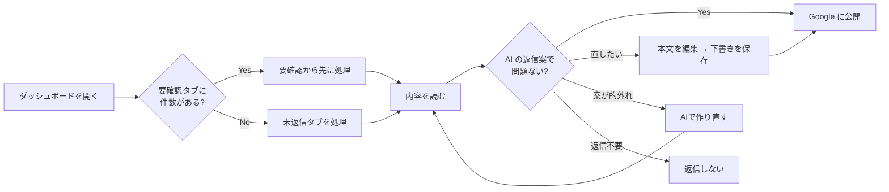

# 04. セットアップ・運用・コスト

## 1. 導入までのクリティカルパス

```mermaid
gantt
    dateFormat X
    axisFormat %s
    section 並行して進める
    Google API アクセス申請（数営業日〜数週間）:crit, a1, 0, 20
    Supabase プロジェクト作成 + マイグレーション :a2, 0, 2
    Vercel デプロイ + 環境変数設定            :a3, 2, 4
    ローカルでの動作確認                      :a4, 4, 8
    section 承認後
    本番での初回同期・返信品質の調整           :a5, 20, 26
```



**最優先タスクは Google の API アクセス申請です。** 承認が下りるまでレビューを 1 件も取得できません。
コードの完成を待たずに、今日中に申請を出してください（手順は `docs/02-google-oauth-flow.md` §3）。

---

## 2. セットアップ

### 2.1 Supabase

```bash
# Supabase でプロジェクトを作成後
supabase link --project-ref <project-ref>
supabase db push
```

CLI を使わない場合は Dashboard → SQL Editor で
`supabase/migrations/0001_init.sql` → `0002_rls.sql` の順に実行します。

### 2.2 秘密鍵の生成

```bash
echo "TOKEN_ENCRYPTION_KEY=$(openssl rand -base64 32)"
echo "SESSION_SECRET=$(openssl rand -base64 48)"
echo "CRON_SECRET=$(openssl rand -hex 32)"
```

> `TOKEN_ENCRYPTION_KEY` を紛失・変更すると、保存済みの refresh_token がすべて復号できなくなり、
> 全ユーザーが再ログインを求められます。パスワードマネージャ等に必ず保管してください。

### 2.3 ローカル起動

```bash
cd hoshi-jungle-review-ai
npm install
cp .env.example .env.local   # 値を埋める
npm run dev                  # http://localhost:3000
```

### 2.4 検証

```bash
npm run typecheck   # 型検査
npm test            # ロジックのユニットテスト（24 件）
npm run build       # 本番ビルド
```

### 2.5 Vercel デプロイ

1. リポジトリを Vercel にインポートし、**Root Directory を `hoshi-jungle-review-ai` に設定**する
   （このリポジトリはルートに静的 LP があるため、指定しないとビルドが失敗します）。
2. `.env.example` の全キーを Environment Variables に登録する（`NEXT_PUBLIC_` 以外は Encrypted）。
3. `NEXT_PUBLIC_APP_URL` と `GOOGLE_REDIRECT_URI` を本番ドメインに合わせる。
4. Google Cloud Console の「承認済みのリダイレクト URI」に本番 URL を追加する。
5. デプロイ。`vercel.json` の `crons` により毎時 0 分のバッチが自動登録されます。

> **⚠️ プラン制約: Vercel の Hobby プランは Cron の最小間隔が「1 日 1 回」です。**
> `0 * * * *`（毎時）はデプロイ時にエラーになります。毎時実行には **Pro プラン（$20/月〜）** が必要です。
> Hobby のまま運用する場合の選択肢:
> - `vercel.json` を `"schedule": "0 1 * * *"` 等に変更して 1 日 1 回にする
> - 外部スケジューラ（GitHub Actions の `schedule` など）から
>   `GET /api/cron/fetch-reviews` を `Authorization: Bearer $CRON_SECRET` 付きで叩く
>
> ホテル運営としては「クチコミ投稿から返信まで 24 時間以内」なら実害は小さいため、
> **まず 1 日 1 回で始め、返信速度を上げたくなった時点で Pro に上げる**のが費用対効果の高い順序です。

---

## 3. 初期設定ウィザード（スタッフ向け・3ステップ）

| ステップ | 画面 | 操作 |
|---|---|---|
| 1 | `/` または `/onboarding` | 「Google アカウントで始める」→ 同意画面で許可 |
| 2 | `/onboarding` | 管理下のロケーション一覧から Hoshi Jungle を選択 |
| 3 | `/onboarding` | 「設定を完了する」→ その場で初回同期が走り、取得件数と生成件数を表示 |

初回同期はクチコミ件数に応じて 1〜2 分かかります（`maxDuration = 300` 秒を確保済み）。

---

## 4. 日常運用

### 4.1 スタッフの作業フロー



**推奨する運用ルール:**

- **要確認タブを先に処理する。** 低評価・インドネシア語・AI が要確認と判定したものが集まります。
  低評価への返信は 24〜48 時間以内が望ましく、放置するほど見込み客への悪影響が大きくなります。
- **インドネシア語（オレンジ表示）は必ず現地スタッフが確認する。** AI の生成文は文法的には正しくても、
  バリ特有の言い回しや敬意表現のニュアンスがずれることがあります。
- **公開前に必ず「下書きを保存」する。** 未保存の編集内容では公開できない仕様にしてあります
  （編集したつもりで AI 原文が公開される事故を防ぐため）。

### 4.2 監視すべきシグナル

| シグナル | 確認場所 | 対応 |
|---|---|---|
| 再認証バナーが出ている | ダッシュボード上部（赤） | 「再認証する」をクリック。Google 側でアクセス権が取り消された可能性 |
| 同期エラーバナーが出ている | ダッシュボード上部（オレンジ） | メッセージを確認。クォータ超過なら時間をおく |
| 最終同期時刻が古い | ダッシュボード下部 | Cron が動いているか Vercel のログで確認 |
| 要確認件数が増え続ける | ナビの「要確認」バッジ | スタッフの処理が追いついていない。運用体制の見直し |

### 4.3 障害調査 SQL

```sql
-- 直近 24 時間の同期実行と結果
select started_at, trigger_source, reviews_new, replies_generated,
       replies_published, error
from sync_runs
where started_at > now() - interval '24 hours'
order by started_at desc;

-- AI 生成に失敗して手動対応が必要なもの
select r.review_id, r.rating, r.text, p.attention_reason
from replies p join reviews r using (review_id)
where p.status = 'failed';

-- 言語判定の内訳（しきい値の妥当性チェック）
select language, language_source, count(*), round(avg(language_confidence)::numeric, 3)
from reviews group by 1, 2 order by 1, 2;

-- モデルごとのトークン消費（コスト分析）
select model,
       count(*) as replies,
       sum((generation_meta->>'input_tokens')::int)  as input_tokens,
       sum((generation_meta->>'output_tokens')::int) as output_tokens
from replies where model is not null group by 1;
```

---

## 5. 自動公開を有効にする場合の手順

**初期導入時は必ず `AUTO_PUBLISH_ENABLED=false`（全件ドラフト）で運用してください。**

有効化を検討してよいのは、以下を満たしてからです。

1. 最低 1 か月、全件を人間が確認する運用を回した
2. 5 つ星レビューに対する AI の返信案を、ほぼ無編集で公開できている
3. 誤った内容・不適切な表現が 1 件も出ていない

条件を満たしたら、段階的に開けます。

```bash
AUTO_PUBLISH_ENABLED=true
AUTO_PUBLISH_LANGUAGES=ja      # まず日本語だけ
AUTO_PUBLISH_MIN_RATING=5      # まず 5 つ星だけ
```

問題がなければ `AUTO_PUBLISH_LANGUAGES=ja,en`、`AUTO_PUBLISH_MIN_RATING=4` と広げます。

**インドネシア語は仕様上、自動公開されません。** `AUTO_PUBLISH_LANGUAGES` に `id` を書いても
`src/lib/env.ts` が除外し、さらに `policy.ts` でも二重にガードしています。

---

## 6. コスト試算

### 6.1 Claude API

想定トークン数: 入力 約 1,300 tok（システムプロンプト + クチコミ本文）/
出力 約 600 tok（返信本文 + adaptive thinking）

| モデル | 単価 (入力/出力 per MTok) | 1 件あたり | 月 100 件 | 月 500 件 |
|---|---|---|---|---|
| `claude-opus-5`（既定） | $5 / $25 | 約 $0.022 | 約 $2.2 | 約 $11 |
| `claude-sonnet-5` | $2 / $10 | 約 $0.009 | 約 $0.9 | 約 $4.3 |
| `claude-haiku-4-5` | $1 / $5 | 約 $0.004 | 約 $0.4 | 約 $2.2 |

> これは概算です。実測値は `replies.generation_meta` に記録されるトークン数
> （§4.3 の SQL）で確認してください。

**推奨: 既定の `claude-opus-5` のまま始めてください。** 単独ホテルの月間クチコミ数では
月額数ドルの差にしかならず、返信品質はブランド価値に直結します。
複数ホテルに横展開して件数が桁違いに増えた段階で、`ANTHROPIC_MODEL=claude-sonnet-5` への
切り替えを A/B で検証するのが妥当な順序です。

生成の深さは `ANTHROPIC_EFFORT`（既定 `low`）で調整できます。
クチコミ返信は難易度の低いタスクなので `low` で十分ですが、
低評価への対応品質を上げたい場合は `medium` を試す価値があります。

### 6.2 インフラ

| サービス | プラン | 月額 | 備考 |
|---|---|---|---|
| Vercel | Hobby | $0 | Cron は 1 日 1 回まで |
| Vercel | Pro | $20〜 | 毎時 Cron に必要 |
| Supabase | Free | $0 | 500MB DB。単独ホテルなら数年分の余裕がある |
| Google Business Profile API | — | $0 | 利用申請の承認が必要 |

**最小構成の月額: 約 $2〜3（Claude API のみ）。**
毎時同期が必要なら Vercel Pro を加えて約 $22〜23。

---

## 7. セキュリティ上の前提

| 項目 | 実装 |
|---|---|
| Google refresh_token | AES-256-GCM で暗号化して DB に保存。鍵は `TOKEN_ENCRYPTION_KEY` |
| セッション | HS256 署名付き JWT を HttpOnly / Secure / SameSite=Lax Cookie に格納（7 日） |
| CSRF（OAuth） | 署名付き `state` + nonce Cookie の二重照合 |
| オープンリダイレクト | `returnTo` は自サイト内パスのみ許可 |
| Cron エンドポイント | `Authorization: Bearer $CRON_SECRET` が一致しなければ 401 |
| Supabase | `service_role` キーはサーバー側のみ（`server-only` でビルド時に強制） |
| DB | 全テーブルで RLS 有効 + `anon`/`authenticated` 全拒否ポリシー |
| 所有権チェック | 返信の編集/公開/再生成はすべて「そのユーザーのロケーションか」を DB で検証 |

---

## 8. 今後の拡張候補（優先度順）

1. **Pub/Sub による即時通知** — My Business Notifications API を使うと、
   新着クチコミを Pub/Sub でリアルタイムに受け取れます。毎時ポーリングを置き換えることで
   「低評価が投稿された瞬間にスタッフへ通知」が可能になり、API クォータ消費も減ります。
   低評価への初動速度は宿泊施設の評判管理で最も効く変数の一つです。
2. **Slack / LINE 通知** — 要確認リストに新規が入ったらスタッフに push する。
   ダッシュボードを見に行く運用は必ず形骸化します。
3. **返信テンプレートの学習** — スタッフが AI 案をどう編集したかの差分を蓄積し、
   プロンプトに Few-shot として注入する。`replies` に `ai_generated_text` と
   `edited_text` を別々に保存しているのは、この分析を後から可能にするためです。
4. **複数ロケーション対応の UI** — DB スキーマは既に複数対応済み（`locations` は 1 対多）。
   ダッシュボードのロケーション切り替え UI を足すだけで、系列ホテルへ横展開できます。
5. **クチコミ分析ダッシュボード** — 評点推移、言語別の傾向、頻出する不満のテーマ抽出。
   返信は「守り」ですが、蓄積されたクチコミデータは施設改善の「攻め」の材料になります。
