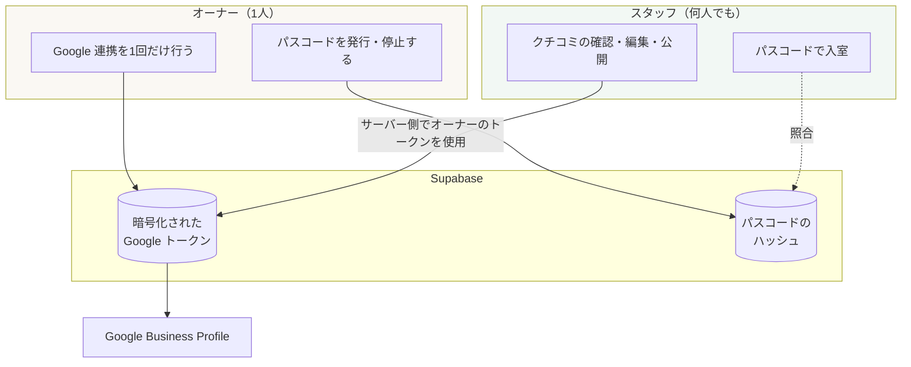
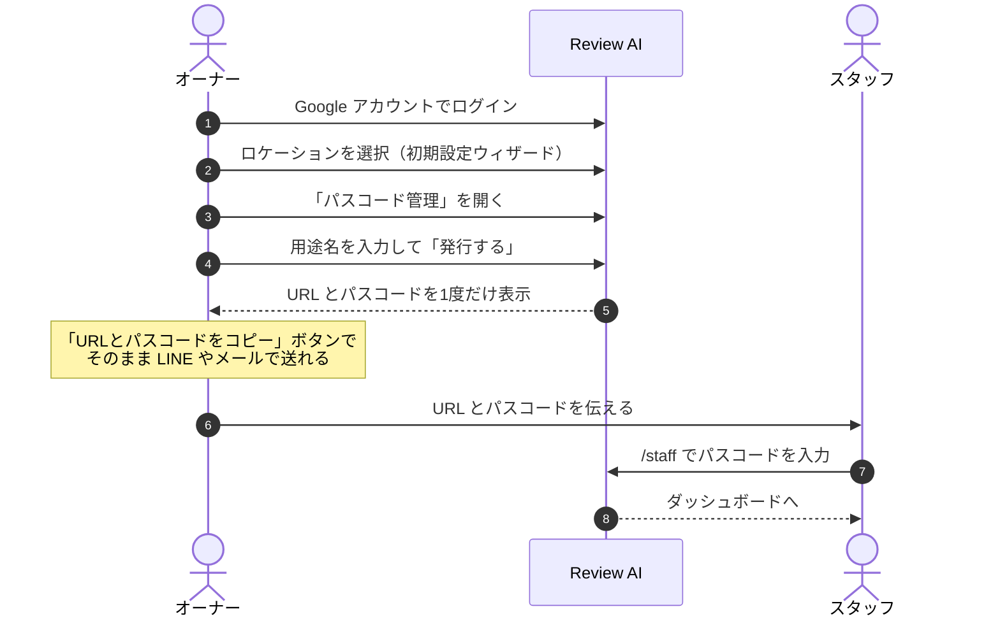

# 05. スタッフへの引き渡しと権限設計

## 1. 「スタッフに渡すもの」は URL とパスコード

このシステムは**ファイルとして配布するソフトウェアではありません。**
サーバー（Vercel）+ データベース（Supabase）+ Google API の 3 つが揃って初めて動きます。

スタッフに渡すのは次の 2 つだけです。

```
URL:        https://<デプロイ先のドメイン>/staff
パスコード: HJ-XXXX-XXXX
```

URL は **Vercel にデプロイした時点で初めて発行されます。**
デプロイ前は URL が存在しないため、渡せるものがありません。

| 段階 | URL の状態 |
|---|---|
| GitHub にコードがある（現在） | URL なし。まだ動かない |
| Vercel にデプロイ | `https://<プロジェクト名>.vercel.app` が自動発行される |
| 独自ドメインを設定（任意） | `https://review.hoshijungle.com` など好きな名前にできる |

---

## 2. なぜパスコード方式にしたか

Google の `business.manage` スコープは**ビジネスプロフィール全体を管理できる権限**です。
クチコミの返信だけでなく、投稿の編集、写真の削除、営業時間の変更まで技術的に可能になります。
「レビューだけ」という細分化スコープは Google が提供していません。

この権限を持つ Google アカウントをフロントスタッフ全員に触らせるのは、次の理由で不適切です。

- スタッフが誤ってビジネスプロフィールの情報を変更してしまうリスク
- 退職時にアカウントの共有を解除する作業が発生する（パスワード変更 → 全員に再通知）
- 誰が何をしたのか追跡できない

そこで役割を 2 つに分けました。



**要点: スタッフは Google の認証情報に一切触れません。**
返信の公開は、サーバー側でオーナーが保存したトークンを使って実行されます。
スタッフが持っているのはパスコードだけなので、退職・漏洩時は
**パスコードを再発行するだけ**で即座に締め出せます。

---

## 3. 権限の比較

| 操作 | オーナー | スタッフ |
|---|:---:|:---:|
| クチコミの閲覧 | ○ | ○ |
| AI 返信案の編集 | ○ | ○ |
| Google への公開 | ○ | ○ |
| AI で作り直す | ○ | ○ |
| 「返信しない」判断 | ○ | ○ |
| 今すぐ同期 | ○ | ○（自分のロケーションのみ） |
| Google アカウント連携 | ○ | ✕ |
| ロケーションの登録・変更 | ○ | ✕ |
| パスコードの発行・停止 | ○ | ✕ |
| 他ロケーションの閲覧 | ○ | ✕ |

権限の判定は UI の出し分けではなく、**API とデータ取得の両方**で行っています
（`requireOwner()` と `getUserLocations(session)` のスコープ絞り込み）。
スタッフが URL を直接叩いても、オーナー用 API は 403、他ロケーションのデータは 404 になります。

---

## 4. 引き渡し手順（オーナーの作業）



1. オーナーが Google でログインし、初期設定を完了する
2. ダッシュボード右上の **「パスコード管理」** を開く
3. 用途名（例:「フロントデスク用」）を入れて **「発行する」**
4. 表示された URL とパスコードを **「URL とパスコードをコピー」** ボタンで控える
5. スタッフに伝える

> **⚠️ パスコードは発行時に 1 度しか表示されません。**
> データベースにはハッシュしか保存していないため、後から見返すことはできません。
> 紛失した場合は「再発行」してください（古いパスコードは即座に無効になります）。

### 用途ごとに分けて発行することを推奨

「フロントデスク用」「マネージャー用」のように分けて発行すると、片方だけを停止できます。
スタッフの入れ替わりが多い部署のパスコードだけを定期的に再発行する、といった運用ができます。

---

## 5. セキュリティ設計

| 項目 | 実装 |
|---|---|
| パスコードの保存 | **平文では保存しない。** scrypt (N=32768, r=8, p=1) でハッシュ化 |
| パスコードの強度 | 30 種類 × 8 文字 = 約 39 ビット（約 6,500 億通り） |
| 総当たり対策 ① | 照合 1 回あたり scrypt で約 93ms かかる（実測値） |
| 総当たり対策 ② | 同一 IP から 15 分あたり 10 回失敗で遮断（429） |
| セッション有効期限 | スタッフ 12 時間（フロントの共用端末を想定し、オーナーの 7 日より短くしている） |
| IP の記録 | 生の IP は保存せず、`SESSION_SECRET` をソルトにした SHA-256 ハッシュのみ |
| 監査ログ | ログイン試行を `staff_login_attempts` に記録。公開操作は「どのパスコード経由か」を `replies.published_by_staff_access_id` に記録 |
| 読み間違い対策 | パスコードから `0 O 1 I L U` を除外（紙に書き写し、口頭で伝える運用のため） |

### レコード単位のロックを実装していない理由

「同じパスコードに N 回失敗したらロック」という方式は、一見安全に見えますが**採用していません。**

パスコードはハッシュでしか保存していないため、不一致だったときに
「どのパスコードを狙った試行だったか」を特定できません。
特定できる形（例: パスコードに識別子を埋め込む）にすると、
**他人のパスコードを故意にロックし続ける嫌がらせが成立してしまいます。**

そのため防御は IP 単位のレート制限と scrypt のコストに寄せています。
約 6,500 億通りに対し、1 回の照合に 93ms かかり、かつ同一 IP は 15 分で 10 回までなので、
総当たりは現実的な時間では完了しません。

### 不審なアクセスの検知

オーナーの「パスコード管理」画面に、直近 24 時間のログイン失敗回数が表示されます。
20 回を超えると警告が出るので、心当たりがなければパスコードを再発行してください。

---

## 6. 共有端末での表示言語

Hoshi Jungle はフロントの共用 PC 1 台を日本人・インドネシア人・アメリカ人の
スタッフが回し使いする運用です。ここで素直に「選んだ言語を覚える」実装にすると、
**前に座っていた人の言語のまま次の人が座る**という事故が起きます。
インドネシア語で固まった画面を日本人スタッフが開く、という状態です。

そこで表示言語を 2 層に分けています。

| 層 | 保存場所 | 生存期間 | 決める人 |
|---|---|---|---|
| 一時的な切り替え | Cookie `hj_ui_lang` | **30 分（操作のたびに延長）** | いま端末に座っている人 |
| パスコードごとの既定 | `staff_access.ui_lang` | 恒久 | オーナー |
| ホテルの既定 | `locations.default_ui_lang` | 恒久 | オーナー |

決定の優先順位は次のとおりです（`resolveUiLang()` に実装、`tests/uiLang.test.ts` で固定）。

```
1. いま座っている人の選択（Cookie / 30分で失効）
2. ログインに使ったパスコードの言語
3. ホテルの既定言語
4. ブラウザの Accept-Language（未ログインの初回アクセス）
5. 日本語
```

要点は **1 が失効すると必ず 2〜3 に戻る**ことです。その場の切り替えは残らず、
既定値だけが残ります。画面には「30分操作がないと◯◯に戻ります」と予告が出るので、
何に戻るか分からないまま切り替わることはありません。

### 運用の推奨: パスコードを言語ごとに分ける

共有端末では、これが一番効きます。

| ラベルの例 | 言語 |
|---|---|
| フロント（日本語） | 日本語 |
| Front Desk (English) | English |
| Resepsionis (Indonesia) | Indonesia |

パスコードに言語を設定しておくと、**入室した瞬間にその言語で開きます**。
スタッフは言語ボタンを押す必要すらありません。
さらに「誰が公開したか」の監査もパスコード単位で残るため、一石二鳥です。

設定はオーナーの「パスコード管理」画面から、発行時にも発行後にも変更できます。

### ログイン時の挙動（なぜ Cookie を常に消さないか）

ログイン時に前の人の Cookie を無条件に消すと、別の事故が起きます。
インドネシア人スタッフがログイン画面を Indonesia に切り替えて入室したのに、
ダッシュボードが日本語に戻ってしまう、という状況です。

そのため次のように分岐しています。

- パスコードに言語が**設定されている** → Cookie を破棄（前の人の残りかもしれないため）
- パスコードに言語が**設定されていない** → Cookie を維持（いま入った人が選んだ言語が唯一の手がかり）

ログアウト時は必ず破棄します。席を立つ人の言語を次の人に引き継がせないためです。

### 既定言語を変えたときの反映タイミング

パスコード／ホテルの既定言語はログイン時にセッションへ焼き込まれます
（毎回の描画で DB を引かないため）。変更が既存のスタッフに反映されるのは
**次回ログイン時**で、スタッフセッションの寿命は 12 時間なので最長でも翌日には揃います。
即時に反映したい場合はスタッフにログアウトしてもらってください。

---

## 7. よくある質問

**Q. スタッフ全員に同じパスコードを配ってよいですか？**
A. はい、それが標準の想定です。個人単位のアカウント管理はホテルの運用負荷が大きく、
現場では形骸化しがちです。「誰が公開したか」の監査が必要になった段階で、
部署・シフト単位でパスコードを分けてください。

**Q. パスコードを忘れました。**
A. オーナーが「再発行」してください。古いパスコードは即座に無効になります。

**Q. スタッフが誤って変な返信を公開してしまいました。**
A. 該当のクチコミを開いて本文を直し、再度公開すれば Google 側の返信が上書きされます
（Google の API は返信の上書きに対応しています）。

**Q. スタッフの Google アカウントが乗っ取られたら？**
A. スタッフは Google アカウントを使いません。影響はありません。
オーナーの Google アカウントが侵害された場合のみ対応が必要です。

**Q. URL を知られたら誰でも入れますか？**
A. 入れません。URL は入口に過ぎず、パスコードがなければダッシュボードには到達できません。
未ログインで `/dashboard` を開いても入口へリダイレクトされます（実測で確認済み）。

**Q. 共用 PC が読めない言語のまま固まってしまいました。**
A. 30 分操作がなければ自動的にホテルの既定言語に戻ります。すぐ戻したい場合は
画面上部の言語ボタンを押すか、ログアウトしてください。恒久的に直すには、
オーナーが「パスコード管理」画面でホテルの既定言語を設定します。

**Q. スタッフごとに言語を固定できますか？**
A. パスコードを言語ごとに分けて発行してください。入室した瞬間にその言語で開きます。
